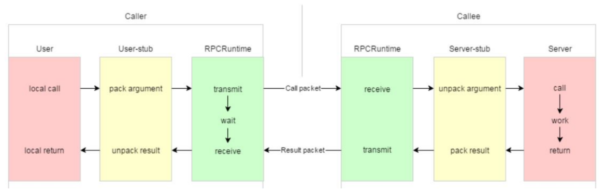

### 项目目录结构
- bin：可执行文件
- build：项目编译文件
- lib：项目库文件
- src：源文件
- test：测试代码
- img: readme图片
- example：框架代码使用范例
- CMakeLists.txt：顶层的cmake文件
- README.md：项目自述文件


### 编译命令：
```js
mkdir build
cd build
cmake ..
make -j12
```

### 运行程序命令
启动rpc provider
```js
Wrpc/bin$ ./provider -i test.conf 
```

启动consumer
```js
Wrpc/bin$ ./provider -i test.conf 
```

### 应用第三方库版本
- muduo v2.0.2
- zookeeper 3.6.3
- protobuffer 3.12.2


### 调用过程详解：

黄色部分：设计rpc方法参数的打包和解析，也就是数据的序列化和反序列化，使用Protobuf。

绿色部分：网络部分，包括寻找rpc服务主机，发起rpc调用请求和响应rpc调用结果，使用muduo网络
库和zookeeper服务配置中心（专门做服务发现）。

